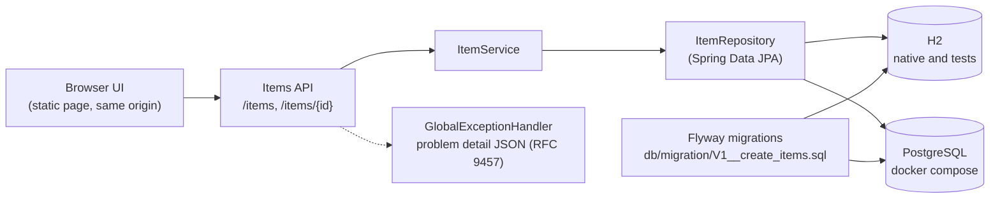

# Java REST API Template

A REST API and its own browser UI, built with Spring Boot 4 and Java 25 to show a runtime: five CRUD endpoints for items, the schema versioned with Flyway, problem detail error bodies, and a Docker runtime with PostgreSQL. Spring Data JPA, validation and Flyway are wired up, so it boots against H2 out of the box.

The UI and the API share one origin on port 8090. In native development the boot console shows SQL statements when Hibernate runs, so a request can be traced from the curl line to the database.

The template has no authentication: the API, the web UI and the h2-console are all open to anyone who can reach the app. In Docker the app is published on `127.0.0.1` only, so only local processes reach it, but that limits exposure rather than replacing authentication. Add Spring Security before using it for anything real.

## Architecture



### What each piece is for:

- **Migrations.** Flyway applies the versioned SQL in `db/migration` one file serves both H2 and PostgreSQL.
- **Errors as data.** A `@RestControllerAdvice` returns problem detail JSON for missing ids and validation failures.
- **Headers.** A single filter adds `nosniff`, a `default-src 'self'`, `no-referrer` and `no-store` to the shared origin.
- **Least privilege in Docker.** Both containers drop unneeded capabilities and wait for the database healthcheck.

## Installation

### Local development

**Requires JDK 25. On Ubuntu/Debian:**
```bash
sudo apt install openjdk-25-jdk-headless
```

**Run or restart the application (first run downloads Gradle, may take a few minutes):**
```bash
./gradlew bootRun
```

**Stop the application:**
```text
Ctrl+C
```

**Stop the Gradle daemon JVMs:**
```bash
./gradlew --stop
```

**Run the compiler (no app start):**
```bash
./gradlew compileJava
```

**Run the tests:**
```bash
./gradlew test
```

**Try the API (while the app runs):**
```bash
# List items: 200, three sample items ship with the template
curl -i http://localhost:8090/items

# Create: 201, the database assigns the id (a body-sent id is ignored);
# the name is required, a blank or missing name returns 400
curl -i -X POST http://localhost:8090/items -H "Content-Type: application/json" \
    -d '{"name":"First item","description":"Optional description"}'

# Read one: 200 with the item, 404 when the id does not exist
curl -i http://localhost:8090/items/1

# Update: 200 with the new values
curl -i -X PUT http://localhost:8090/items/1 -H "Content-Type: application/json" \
    -d '{"name":"Renamed","description":"Updated description"}'

# Delete: 204, no body
curl -i -X DELETE http://localhost:8090/items/1

# Health probe: 200 {"status":"UP"}
curl -i http://localhost:8090/actuator/health
```

Errors come back as problem detail JSON: a missing id is a 404 "Item not found", a blank or missing name is a 400 "Validation failed" with the rejected field.

### Open the web UI (native app and Docker both run):
```text
http://localhost:8090/
```
The UI covers the same five operations in the browser: listing, viewing, adding, editing and deleting items. Deleting asks for confirmation first. The page is served by the app from `src/main/resources/static` and styled with the vendored Simple.css.

### Run in Docker

PostgreSQL runs alongside the app, configured in one compose file. Copy .env.example to .env and fill in your own values before the first start (the compose file reads `POSTGRES_DB`, `POSTGRES_USER` and `POSTGRES_PASSWORD` from it):

```bash
cp .env.example .env
```

Build and start, attached to the terminal (Ctrl+C stops the containers):
```bash
docker compose up --build
```

Build once, then run detached in the background:
```bash
docker compose up -d --build
```

The app connects to the database with the `SPRING_DATASOURCE_*` variables set in `compose.yaml`, then Flyway builds the schema by running the migrations in `db/migration`. Migrations work same way on the embedded H2 in native development and tests. Only the app container reaches the Postgres port. The app itself is published on `127.0.0.1:8090`, localhost only.

Data lives in the volume postgres_data and survives docker compose down and up. Deleting the volume deletes the data. A volume created before Flyway was introduced has no migration history and fails startup. Delete it once and a fresh start is clean.

Both containers get a least-privilege runtime: the app drops every capability and runs with a read-only root filesystem (tmpfs only for /tmp), the database drops a small fixed set of capabilities it does not need.

### Stop the container
```bash
docker compose down
```

## Notes from the build

- **Spring Boot 4 ships auto-configurations.** `flyway-core` and `spring-boot-flyway` are needed to activate Flyway, and `flyway-database-postgresql` for the PostgreSQL dialect.
- **A volume from before Flyway fails startup on purpose.** It has the tables but no migration history, delete it once with `docker compose down -v`, then volumes get created cleanly.

## Spring Initializr settings

- Project: Gradle - Groovy
- Language: Java
- Spring Boot: 4.1.1

### Project Metadata:

- Group: com.restapitemplate
- Artifact: rest-api-template
- Package name: com.restapitemplate.restapitemplate
- Packaging: Jar
- Configuration: Properties
- Java: 25
- Dependencies: Spring Data JPA, Spring Web, Lombok, Spring Boot DevTools, H2 Database, PostgreSQL Driver

## Project notes

Using server port 8090 for this project everywhere as the host 8080 is already occupied by an unrelated process on the dev machine.

Development now shows Hibernate's SQL in the bootRun console (spring.jpa.show-sql=true).

So this API is meant to be same-origin: The UI and the endpoints share the app on port 8090. There is no CORS configuration because of this.

### Browse the in-memory database (native app runs):
```text
http://localhost:8090/h2-console
```
The database resets every time the app stops.

Native bootRun keeps the H2 console open. The Docker container sets `SPRING_H2_CONSOLE_ENABLED=false`, so it is closed there, and Docker connects to PostgreSQL instead of H2.
